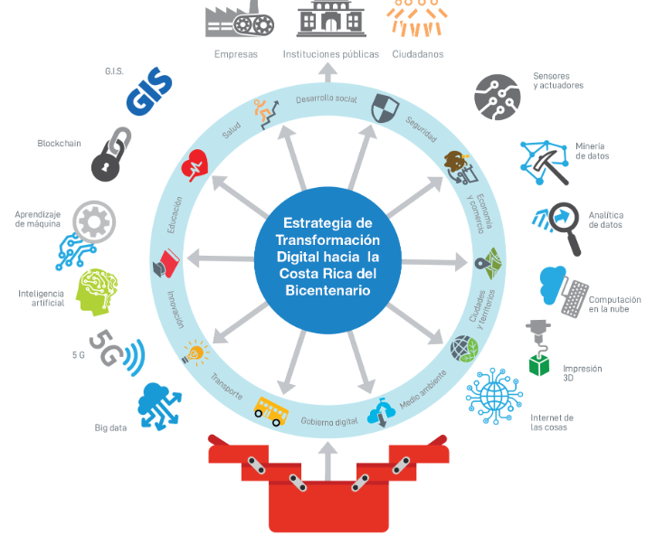

# Orientación

## Objetivo
El objetivo de esta organización es promover el uso de los datos abiertos provenientes de instituciones gubernamentales de Costa Rica gracias a la iniciativa de [Gobierno Abierto](http://www.gobiernoabierto.go.cr/), 

Con esta organización pretendemos empoderar a los ciudadanos para que mediante la ciencia de datos se pueda promover la cogobernanza de las instituciones publicas del estado costarrcense. 

Esta iniciativa de datos abiertos Costa Rica va acorde con la [Estrategia de Transformación Digital hacia la Costa Rica del Bicentenario 4.0](https://micit.go.cr/images/imagenes_noticias/17-10-2018_Estrategia_de_Transformaci%C3%B3n_Digital_hacia_la_Costa_Rica_del_Bicentenario/estrategia_de_transformacion_digital_de_costa_rica.pdf)

Queremos promover el uso a través de la creación de ejemplos y tutoriales utilizando el lenguaje de programación R.

## Código de conducta

Si querés participar creando material para la organización estas más que bienvenido. Solamente hay que tomar en cuenta el código de conducta para hacer de esto una experiencia amena. 

Podés leer el [código de conducta](https://github.com/datos-abiertos-cr/orientacion/blob/master/codigo-de-conducta.md) que hemos incluido.

